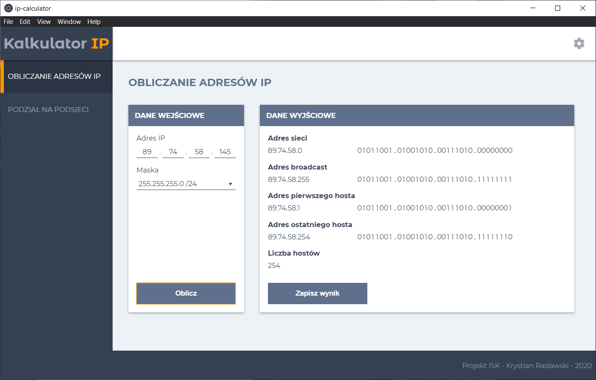
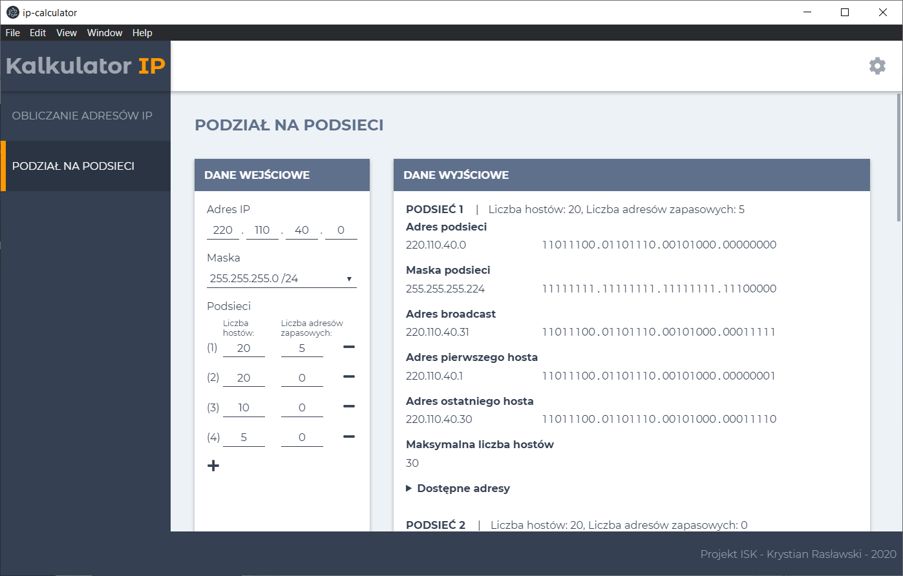

# IP-Calculator

Simple IP calculator with subnetting, written in Vue.js + Electron





## Project setup
```
npm install
```

### Compiles and hot-reloads for development
```
npm run electron:serve
```

### Build
```
npm run electron:build
```